<div align="center">

# 👁️ Vision Hero

**A gamified vision-training app for children with amblyopia and strabismus.**

Twenty-two short exercises themed around vehicles, metro maps, rockets, rescue pups and
the zoo — built to make daily eye training something a child asks for rather than resists.

[](LICENSE)
[](https://react.dev)
[](https://www.typescriptlang.org)
[](https://vite.dev)


</div>

## About

Amblyopia ("lazy eye") is usually treated by patching the stronger eye so the weaker one is
forced to work. The patch alone is passive, though — the eye improves fastest when it is
*doing* something visually demanding, which is why eye doctors ask families to add active
exercises at home.

Vision Hero turns that homework into a game. Each exercise targets a specific visual skill
that clinical vision therapy trains — smooth pursuit, saccades, fixation, contrast
sensitivity, acuity under crowding, peripheral awareness, visual memory — and every session
is scored, so a child collects points and levels up instead of counting minutes.

**Compliance is the hardest part of amblyopia treatment.** Everything here is designed
around that: sessions are short, targets are large and friendly by default, mistakes cost a
point rather than ending the game, and every round finishes with confetti.

## Highlights

- **Twenty-two exercises**, each training a different visual skill — including a 3D depth game
  and a passive cartoon for tired days
- **Today's Mission** — one big button plays three short games back to back and awards a
  vehicle sticker for the day
- **Spoken instructions** — every game says what to do out loud, so a child who cannot read
  yet can play on their own
- **No countdown numbers** — time is a little car driving towards a finish flag
- **Three difficulty presets** plus manual control over speed, target size and session length
- **Red/cyan anaglyph mode** for dichoptic training with 3D glasses, on by default
- **Animated previews** on every home tile, so a child picks a game by recognising the
  picture rather than reading the title
- **Built for touch** — every control clears the 44px minimum tap target, with type and
  contrast to match
- **Fits the screen** — the home grid and the play area both size themselves to one
  viewport height, so nothing scrolls out of a child's reach
- **Installable and offline** — add it to a tablet's home screen and it launches full
  screen, with no browser chrome, and keeps working without a connection
- **Progress tracking** — XP, levels and per-exercise history saved locally in the browser
- **Sound and haptic-style feedback**: rising tones for hits, a buzz and screen shake for misses
- **No account, no backend, no data collection** — everything stays in the browser

## Exercises

<table>
<tr>
<td width="50%" valign="top">


### 🚀 Rocket Tracker
**Smooth pursuit** — a rocket glides along a looping path across the whole screen. Tap it
as often as you can while it moves, keeping the eye locked on a continuously moving target.

</td>
<td width="50%" valign="top">


### ✈️ Foggy Flight
**Contrast sensitivity** — aircraft appear in thick fog, fading a little more with every
hit. Trains the eye to pull faint shapes out of a low-contrast background.

</td>
</tr>
<tr>
<td width="50%" valign="top">


### 🚗 Traffic Jam
**Visual discrimination** — one vehicle in the grid is different from all the others.
Find it, and a fresh grid appears immediately.

</td>
<td width="50%" valign="top">


### 🏎️ Speedway Saccades
**Saccadic eye movements** — the car jumps from one side of the screen to the other,
forcing the fast, accurate eye jumps that reading depends on.

</td>
</tr>
<tr>
<td width="50%" valign="top">


### 📡 Peripheral Patrol
**Peripheral awareness** — hold your gaze on the central crosshair while targets appear
around the edges of the screen. Widens the useful visual field.

</td>
<td width="50%" valign="top">


### 🌫️ Foggy Spotter
**Contrast sensitivity** — every tile looks the same except one, which is slightly faded.
Difficulty controls just how subtle that difference is.

</td>
</tr>
<tr>
<td width="50%" valign="top">


### 🛡️ Checkpoint
**Discrimination and reaction time** — a target vehicle is shown, then vehicles arrive one
at a time. Tap only the matching ones before the timer runs out.

</td>
<td width="50%" valign="top">


### 🚇 Metro Tracker
**Smooth pursuit** — a train runs slowly back and forth along a winding metro line, and
stations light up as it passes. The wide left-right sweeps exercise full horizontal
eye movement.

</td>
</tr>
<tr>
<td width="50%" valign="top">


### 📍 Station Hunt
**Acuity under crowding** — find the announced station among look-alike letters packed
close together (E/F/H/L, O/Q/C/G). Crowded fine detail is the core deficit in amblyopia.

</td>
<td width="50%" valign="top">


### 🗺️ Line Navigator
**Visual tracing** — follow one colored metro line through a tangle of crossing lines,
using your eyes only, and tap the terminal it reaches.

</td>
</tr>
<tr>
<td width="50%" valign="top">


### 🚋 Railway Crossing
**Pursuit and selective attention** — trains and cars cross the screen on rail lanes.
Tap only the trains and let the cars pass: a go/no-go task that adds impulse control.

</td>
<td width="50%" valign="top">


### 🧠 Metro Memory
**Visual memory** — stations light up in sequence on a mini metro map; repeat the route in
order. The route grows by one station after every success.

</td>
</tr>
<tr>
<td width="50%" valign="top">

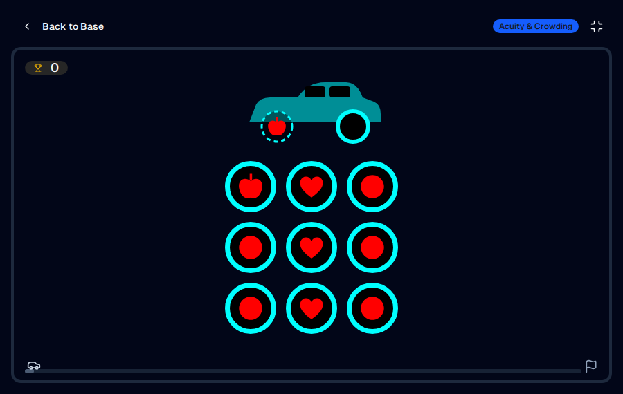

### 🔺 Shape Garage
**Acuity under crowding, for pre-readers** — a car rolls in missing a wheel with a shape on
it; find that wheel on a crowded tyre rack. Uses picture symbols in the spirit of the LEA
Symbols chart (circle, apple, heart, square, house, triangle) instead of letters, with
look-alikes as distractors. Shapes shrink after each find and grow back after a miss.

</td>
<td width="50%" valign="top">

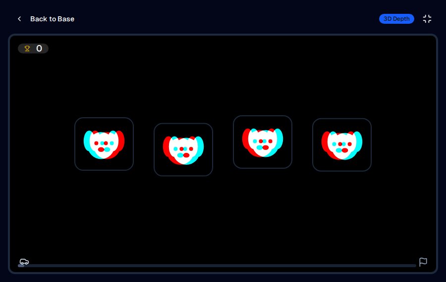

### 🐶 Pop-Out Pups
**Stereopsis (3D depth)** — every pup is drawn once per eye; one floats out of the screen,
the rest sink behind it. All pups carry the same amount of offset, so only the two eyes
working together can find the odd one. The depth adapts to the child (less after a find,
more after a miss). On hard, every other round is a random-dot stereogram. **Needs red/cyan
glasses, so it only appears while anaglyph mode is on.**

</td>
</tr>
<tr>
<td width="50%" valign="top">

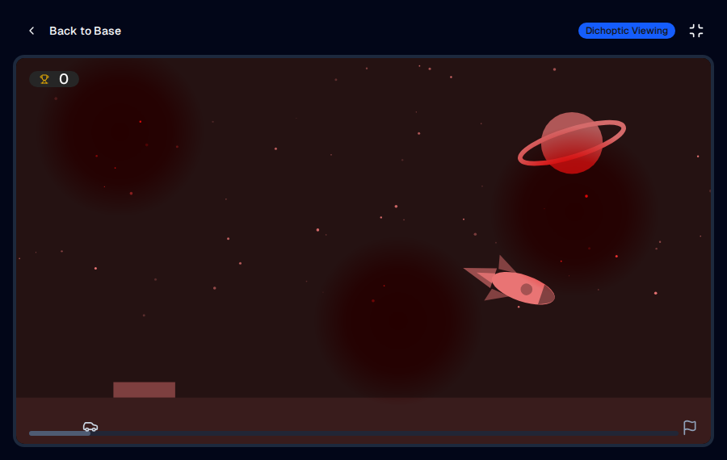

### 🎬 Cartoon Cinema
**Passive dichoptic viewing** — a looping cartoon (rocket launch, metro ride, night flight).
With the glasses on, the weaker eye sees the full picture while the stronger eye gets a
dimmer copy with soft patches drifting over it, so parts of the story are only visible to
the weaker eye. Stars pop up now and then; tapping one shows the child is still watching.
Without anaglyph mode it plays as an ordinary full-colour cartoon.

</td>
<td width="50%" valign="top">

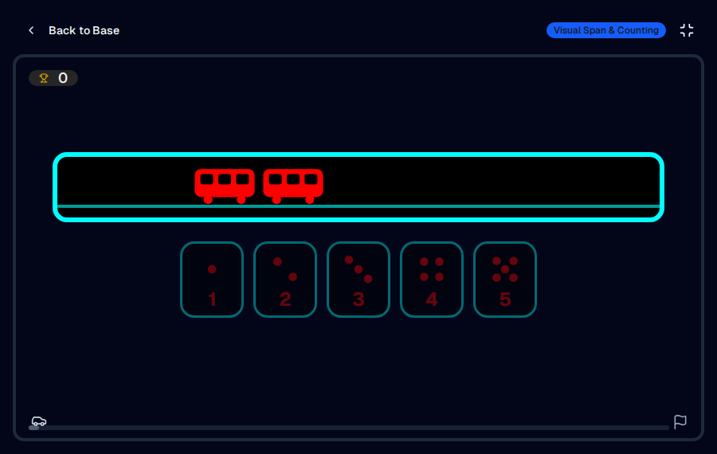

### 🚇 Count the Carriages
**Visual span and counting** — a metro train rushes past a window for a second or two;
how many carriages did it have? Answer cards show dots as well as the digit. Small numbers
are seen at a glance rather than counted, so this trains taking in a whole picture in one
look. A wrong answer just sends the same train past again.

</td>
</tr>
<tr>
<td width="50%" valign="top">

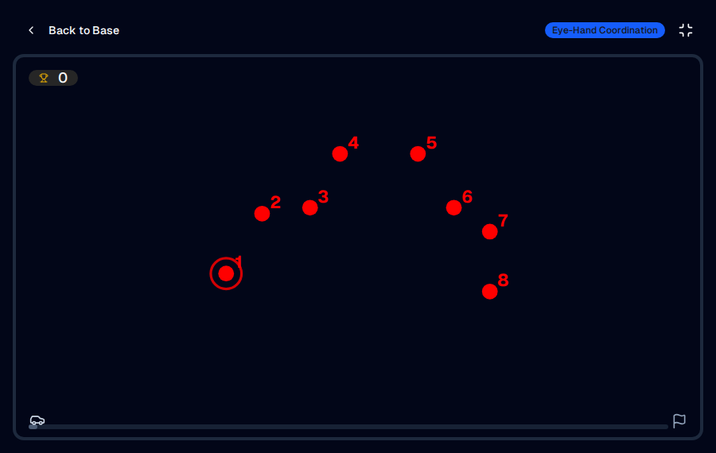

### 🚀 Rocket Dot-to-Dot
**Eye-hand coordination and saccades** — slide a finger from 1 to 2 to 3… to draw a
kite, bus, car, rocket, star or plane, which then takes off. Each number is read aloud as it
is reached. Harder levels use more dots, and hard adds unnumbered decoy dots.

</td>
<td width="50%" valign="top">

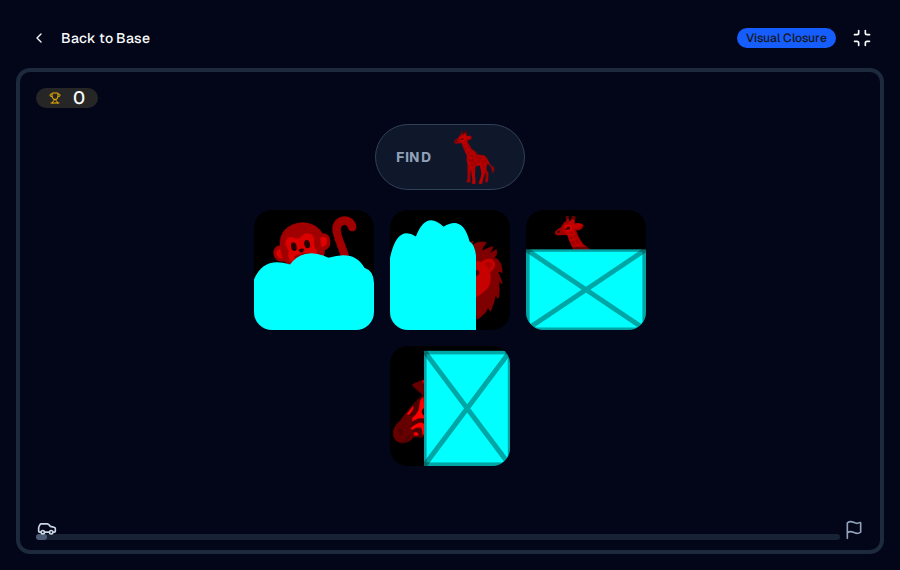

### 🦁 Zoo Hide & Seek
**Visual closure** — zoo animals hide behind bushes, crates and rocks with only an ear,
a back or a tail showing. Find the animal that is named. Less of each animal shows on
harder levels.

</td>
</tr>
<tr>
<td width="50%" valign="top">

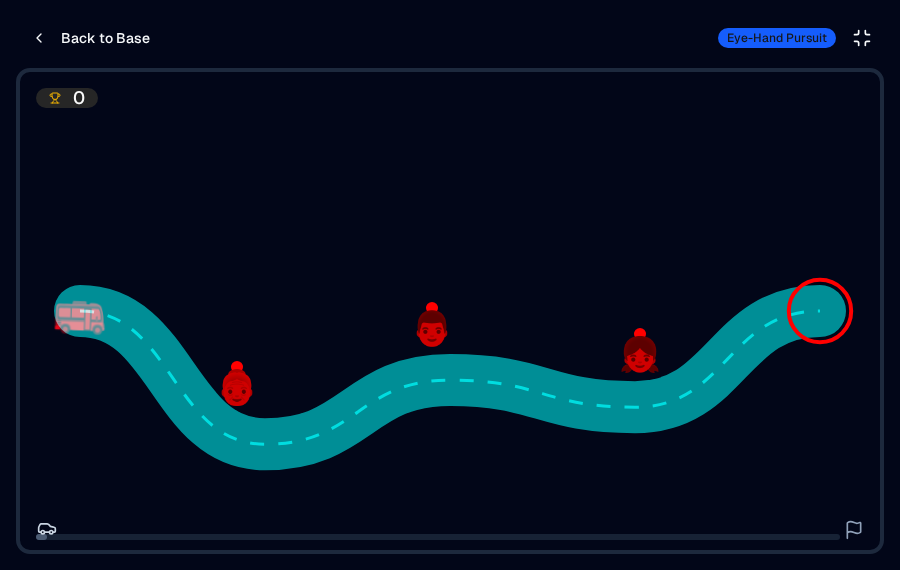

### 🚌 Bus Driver
**Eye-hand pursuit** — drive the bus along a winding road with a finger and pick up the
passengers at each stop. The bus only moves while the finger stays on the road near it.
With the glasses on, the road is drawn for one eye and the bus for the other, so steering
needs both eyes' pictures combined.

</td>
<td width="50%" valign="top">

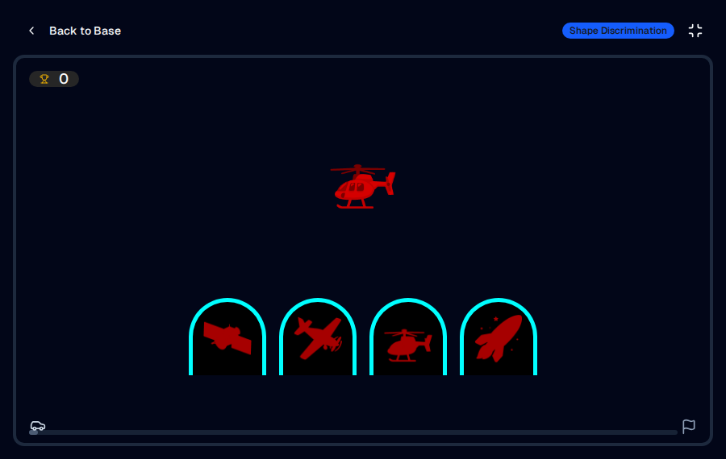

### ✈️ Hangar Match
**Shape discrimination** — drag each aircraft into the hangar that shows its shadow (or
tap the hangar). On hard the shadows are turned at an angle, so the outline has to be
recognised whichever way it faces.

</td>
</tr>
<tr>
<td width="50%" valign="top">

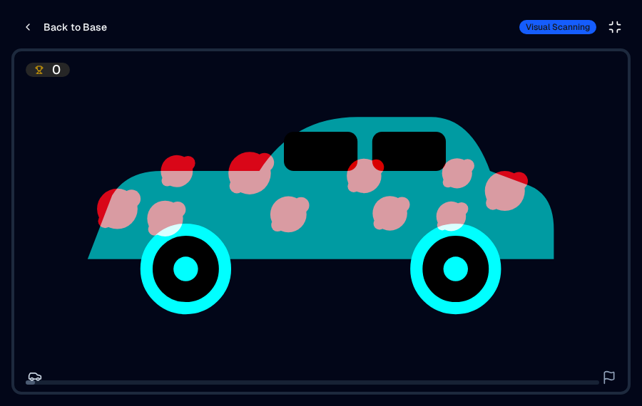

### 🧽 Car Wash
**Systematic scanning** — rub every mud spot off a muddy car, then watch it drive off
sparkling. Spots get smaller, more numerous and fainter on harder levels, so the whole car
has to be searched. With the glasses on, the mud is visible only to the target eye.

</td>
<td width="50%" valign="top">

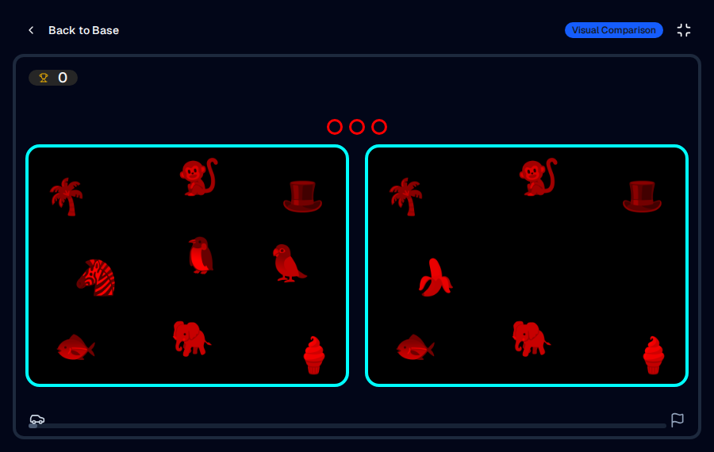

### 🐧 Spot the Difference
**Visual comparison** — two small zoo pictures side by side; find the two or three things
that are different (missing, swapped or, on hard, resized). There's no time pressure, and
a sparkle hints at a difference after 15 seconds without a find.

</td>
</tr>
</table>

## Made for five-year-olds

- **Today's Mission.** The big yellow button picks two games the child has played least
  recently, then finishes with Cartoon Cinema. Each game runs for the *Daily Mission Game
  Length* (2 minutes by default). Finishing the mission earns one vehicle sticker per day,
  shown on the sticker shelf at the bottom of the home screen.
- **Spoken instructions.** Each exercise reads its instruction aloud when it opens, and the
  new games also speak each round's prompt ("Find the heart wheel!"). This uses the
  browser's built-in voices, so it works offline.
- **No countdown numbers.** The seconds counter is replaced by a little car driving along a
  road to a finish flag. The new games never take points away for a wrong tap.
- **Picture-first home screen.** Every tile, including the new ones, has an animated preview.
- **Works with the glasses.** Every game supports red/cyan mode. Picture-based games recolour
  their emoji into the calibrated target or scenery colour with an SVG filter, and targets
  drawn over scenery (the mud on the car, the bus on the road) are added on top of it, so
  the scenery eye never sees a target-shaped hole.

## Treatment plan and Patch Pal

Amblyopia treatment runs for years and changes along the way: patching, sometimes surgery,
then training the weaker eye, then both eyes together. **Treatment Plan** in Parent's Corner
lets a parent match the app to the stage the eye doctor has set. Choosing a stage applies
its settings once; everything stays adjustable, and the app never changes stage by itself.

| Stage | What the app does |
|-------|-------------------|
| **Free play** | No restrictions (the default) |
| **Before surgery** | One eye with the patch on: red/cyan mode off, comfort zone on, patch check before playing |
| **Recovery** | Games and missions are paused behind a get-well screen; Patch Pal stays available |
| **Weaker-eye training** | Like *Before surgery*; the comfort zone can be turned off if eye movement allows |
| **Two eyes together** | Red/cyan mode on. Start only when the eye doctor or orthoptist agrees |
| **Keeping the gains** | Shorter (1-minute) mission games after patching is reduced or stopped |

- **Patch Pal** is a patch-time companion. A pirate timer runs on the wall clock, so it keeps
  counting with the app closed, and is credited to the day the patch went on. It shows
  today's time against the daily goal, the last seven days, and has ±15-minute buttons for
  a forgotten timer. Reaching the goal earns one pirate sticker per day. A forgotten timer
  is capped at 8 hours.
- **Patch check.** In the one-eye stages, tapping a game or the daily mission while the
  timer is off asks "Patch on, glasses on?" first. One tap starts the timer and the game.
- **Comfort zone** keeps the left 22% of the play area empty, so targets never ask an eye
  with limited outward movement (as in a sixth-nerve palsy or Duane syndrome) to look far
  to the left. Ask the eye doctor whether it applies.

## Monthly picture check and backup

- **Monthly picture check** (Parent's Corner) is a short home check with picture symbols
  (circle, square, house, apple, in the style of the LEA Symbols chart), drawn at their real
  size for a fixed distance.
  - **Setup:** a one-time card calibration (drag a box to the width of a bank card) makes
    millimetres accurate on each screen.
  - **Distance:** 1 m, with the parent tapping what the child names or points to, or 40 cm,
    with the child tapping.
  - **Crowding box:** optional, as crowded symbols are harder for an amblyopic eye.
  - **Procedure:** lines from 0.05 to 1.0 (logMAR 1.3 → 0.0), five pictures a line; three
    right passes a line and three wrong ends the check. It starts two lines easier than last
    time, and never goes below what the screen can draw sharply.
  - **Results:** saved per eye with distance, glasses and crowding, shown as a chart and a
    table. The card shows **Due** after 30 days.
  - This is a **trend check, not a medical test**. Its value is doing it the same way every
    month and bringing the history to checkups.
- **Backup** saves everything to one `vision-hero-backup-YYYY-MM-DD.json` file: progress,
  stickers, game history, the patch log, picture checks and settings. It goes through the
  tablet's share sheet (Files, Drive, email) or as a download.
  - **Restore** checks the file first and asks for confirmation in the page before
    replacing anything.
  - The screen's own colour and size calibration is kept, since the backup's came from
    another screen.
  - Parent's Corner recommends a new backup after 30 days.

## Parent's Corner


Every exercise reads from one shared configuration, so you can tune a session to the child
rather than to the game:

| Setting | What it does |
|---------|--------------|
| **Treatment plan** | Stage, comfort zone and daily patch goal (see above) |
| **Picture check / Backup** | Monthly picture check and backup file (see above) |
| **Difficulty** | `easy` / `medium` / `hard` presets for speed, target size and grid density |
| **Movement speed** | How fast targets travel — lower it for younger children |
| **Target size** | 20–100px; larger targets suit deeper amblyopia |
| **Session duration** | 10–300 seconds per round |
| **Sound effects** | Feedback tones on and off |
| **Full screen exercises** | Fill the whole screen when an exercise starts |
| **Daily mission game length** | 60–240 seconds per game in Today's Mission |
| **Cartoon Cinema length** | 1–10 minutes for a free-play show |
| **Spoken instructions** | Read instructions aloud on and off |
| **Anaglyph mode** | Red/cyan dichoptic rendering, **on by default**, with per-device colour calibration (see below). Pop-Out Pups is only shown while it is on |
| **Cartoon Cinema: strong-eye picture** | 0–100% brightness of the scenery eye's copy of the cartoon (anaglyph mode only) |

Progress, level and per-exercise history are stored in the browser's `localStorage` under
`eyequest_user`; exercise settings under `eyequest_config` and the display calibration under
`eyequest_display` — nothing is uploaded anywhere.

### Red/cyan anaglyph mode

Anaglyph mode is **on by default**, so the app expects red/cyan glasses out of the box; turn
it off in Parent's Corner to play in ordinary colours. With it on, targets render in one
colour and all scenery in its complement — red and cyan by default. Wearing red/cyan glasses, the eye behind the red filter sees the targets
clearly while the other eye sees only the background, so the weaker eye has to do the work
while both eyes stay open. This is the dichoptic principle used in clinical amblyopia
software.

### Display calibration

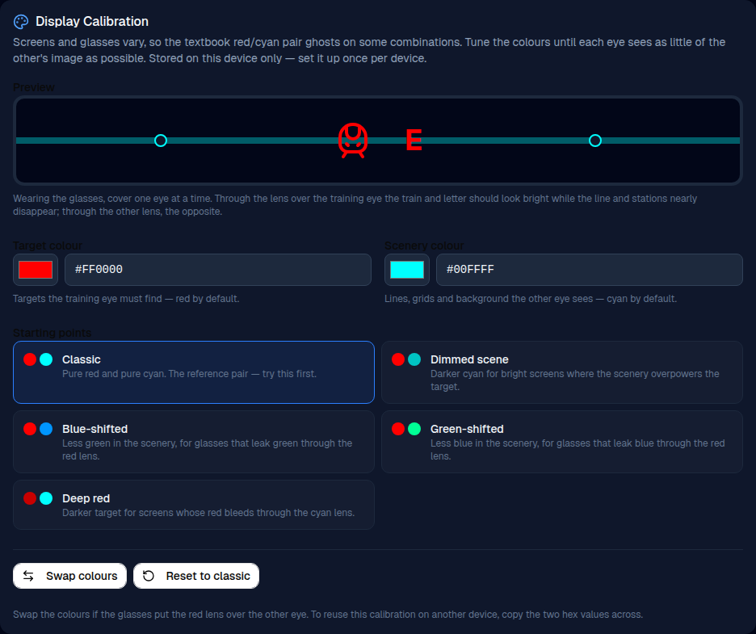

Panels differ in how saturated their red and cyan primaries are, and inexpensive glasses
differ in what they actually block, so the textbook pure red / pure cyan pair ghosts badly on
some combinations. Enabling anaglyph mode reveals a calibration panel where both colours are
adjustable:

- **Target and scenery brightness** — the strongest control. No filter blocks the opposite
  colour completely, and a full-intensity target leaks the most, so dimming the target is
  what stops it ghosting as a grey outline through the other lens.
- **Colour pickers and hex fields** for the target and scenery colours.
- **Starting points** — presets for dimmer scenery on bright screens and green- or
  blue-shifted cyan for filters that leak.
- **Live preview**, plus a **full-screen test** on a pure black field. Use the full-screen
  test to judge a setting: the lit settings page around the inline preview reaches both eyes
  and masks the very ghosting you are looking for.
- **Swap colours** — if the glasses put the red lens over the other eye.
- **Reset to classic** — back to pure `#FF0000` / `#00FFFF` at full brightness.

To calibrate: open the full-screen test, put the glasses on and cover one eye at a time. Dim
the target until it disappears through the scenery lens while staying clearly visible through
the other one. On laptop LCDs the useful range is usually 50–70%; training in a dim room
helps, because backlight bleed means screen black is never fully black.

The calibration is saved **per device** under its own storage key, separate from the exercise
settings, so it is set up once for a given screen and survives changes to difficulty,
duration and the rest. It does not sync between devices — to reuse it elsewhere, copy the
colours and brightness levels across.

Ask your ophthalmologist or orthoptist whether dichoptic training is appropriate, and which
eye should be behind the red filter.

Pop-Out Pups assumes standard red-left glasses, with the target-colour filter over the left
eye. If the lenses are the other way round, the odd pup sinks into the screen instead of
floating out. It is still the only one that looks different, so the game still works.

## Running it full screen

The home screen and every exercise lay themselves out inside a single viewport height, so
the app already uses the whole window without scrolling. To lose the browser chrome as well:

- **Install it (best for daily training).** On an Android tablet, open the site in Chrome and
  choose *Install app* / *Add to Home Screen*; on iPad Safari use *Share → Add to Home
  Screen*; on desktop Chrome or Edge, use the install icon in the address bar. The
  [web app manifest](public/manifest.webmanifest) requests `display: fullscreen`, so
  launching from the installed icon opens the app with no browser UI at all.
- **Or let exercises go full screen.** *Full Screen Exercises* in Parent's Corner (on by
  default) puts the app into full screen when an exercise starts.

A web page cannot put itself into full screen on load — browsers only grant it in response to
a tap or click — which is why the app asks at the moment an exercise begins, and why
installing is the way to have it open full screen every time.

### On tablets

Several things are tuned for a child using this on a tablet:

- A [service worker](public/sw.js) caches the app, which is what lets Android install it as a
  real standalone app rather than a browser shortcut — and means a session runs with no
  connection at all.
- The screen is held awake for the length of an exercise, so the tablet does not dim while a
  child is watching a slow target without touching anything.
- Pull-to-refresh is disabled, so swiping down on a target cannot reload the app mid-exercise,
  and double-tap zoom and tap highlights are off, so every tap lands on the target.
- The layout keeps clear of camera cutouts and rounded corners via safe-area insets, and
  follows the screen through rotation.

One caveat: **iPhone Safari does not support the Fullscreen API**, so the in-app setting has
no effect there — installing to the home screen is the only route. iPad and Android both
support either.

## Getting started

**Prerequisites:** Node.js 18 or newer.

```bash
npm install     # install dependencies
npm run dev     # start the dev server on http://localhost:3000
```

Other scripts:

```bash
npm run build    # production build into dist/
npm run preview  # serve the production build locally
npm run lint     # type-check with tsc --noEmit
npm run clean    # remove dist/
```

## Deployment

Pushes to `main` build the app and publish it to GitHub Pages via
[.github/workflows/deploy-pages.yml](.github/workflows/deploy-pages.yml).

One-time setup: in **Settings → Pages**, set **Source** to **GitHub Actions**.

The site is served from `https://<user>.github.io/vision_hero_trainer/`, so `vite.config.ts`
sets `base` to `/vision_hero_trainer/` for production builds. Renaming the repository means
updating that value.

## Tech stack

| | |
|---|---|
| **UI** | React 19, TypeScript, Tailwind CSS v4 |
| **Build** | Vite 6 |
| **Animation** | Motion, canvas-confetti |
| **Icons** | lucide-react |
| **Audio** | Web Audio API (generated tones, no audio files) and the Web Speech API for spoken instructions |
| **Storage** | Browser `localStorage` |

Components follow the [shadcn/ui](https://ui.shadcn.com) conventions and live in
[`components/ui`](components/ui). Screens and the original twelve games are in
[`src/App.tsx`](src/App.tsx); the ten newer games live in [`src/games`](src/games),
together with their shared timer, start screen and anaglyph tint helpers
([`src/games/common.tsx`](src/games/common.tsx)). Sound, speech and colour helpers are in
[`src/feedback.ts`](src/feedback.ts), the in-game progress bar in
[`src/GameHud.tsx`](src/GameHud.tsx), and shared types and presets in
[`src/types.ts`](src/types.ts) and [`src/constants.ts`](src/constants.ts).

## Disclaimer

Vision Hero is a training aid, not a medical device, and it does not diagnose or treat any
condition. It is meant to complement — never replace — the treatment plan prescribed by a
qualified eye care professional, including patching schedules, glasses and follow-up
appointments. Always follow your ophthalmologist's or orthoptist's instructions on how long
and how often a child should train.

## License

Released under the [Apache License 2.0](LICENSE).
