<div align="center">

# 👁️ Vision Hero

**A gamified vision-training app for children with amblyopia and strabismus.**

Twelve short exercises themed around vehicles, metro maps and trains — built to make
daily eye training something a child asks for rather than resists.

[](LICENSE)
[](https://react.dev)
[](https://www.typescriptlang.org)
[](https://vite.dev)

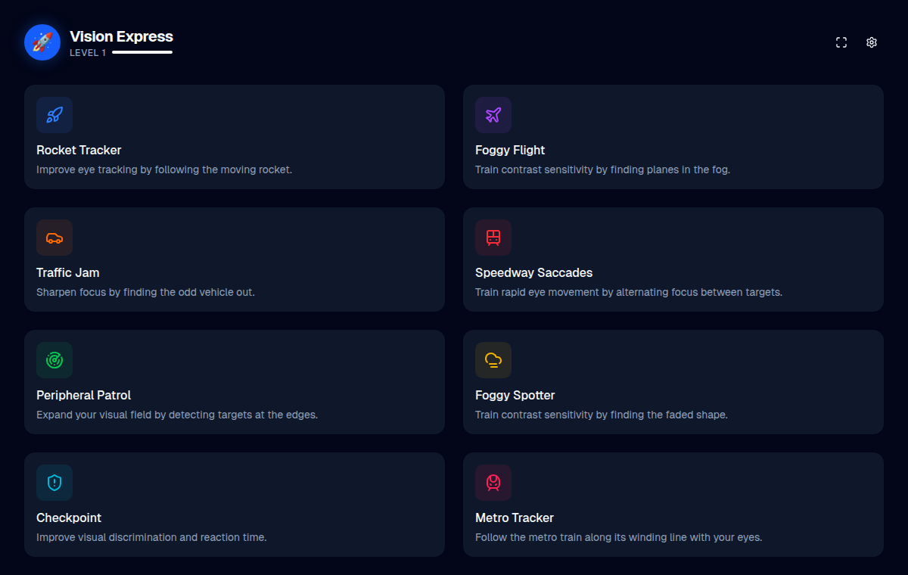

</div>

## About

Amblyopia ("lazy eye") is usually treated by patching the stronger eye so the weaker one is
forced to work. The patch alone is passive, though — the eye improves fastest when it is
*doing* something visually demanding, which is why eye doctors ask families to add active
exercises at home.

Vision Hero turns that homework into a game. Each exercise targets a specific visual skill
that clinical vision therapy trains — smooth pursuit, saccades, fixation, contrast
sensitivity, acuity under crowding, peripheral awareness, visual memory — and every session
is scored, so a child collects points and levels up instead of counting minutes.

**Compliance is the hardest part of amblyopia treatment.** Everything here is designed
around that: sessions are short, targets are large and friendly by default, mistakes cost a
point rather than ending the game, and every round finishes with confetti.

## Highlights

- **Twelve exercises**, each training a different visual skill
- **Three difficulty presets** plus manual control over speed, target size and session length
- **Red/cyan anaglyph mode** for dichoptic training with 3D glasses
- **Full-screen play area** that uses every pixel of the display, on desktop or tablet
- **Progress tracking** — XP, levels and per-exercise history saved locally in the browser
- **Sound and haptic-style feedback**: rising tones for hits, a buzz and screen shake for misses
- **No account, no backend, no data collection** — everything stays in the browser

## Exercises

<table>
<tr>
<td width="50%" valign="top">

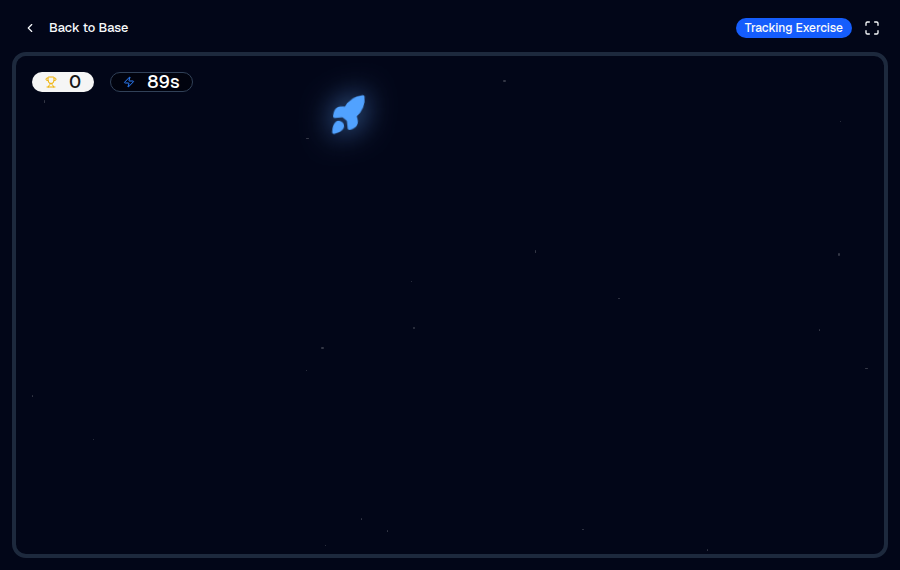

### 🚀 Rocket Tracker
**Smooth pursuit** — a rocket glides along a looping path across the whole screen. Tap it
as often as you can while it moves, keeping the eye locked on a continuously moving target.

</td>
<td width="50%" valign="top">

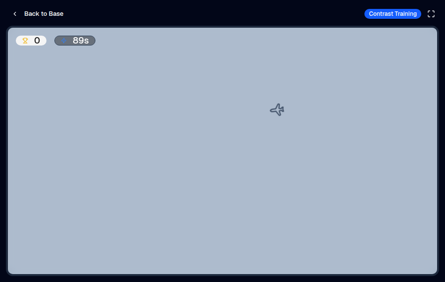

### ✈️ Foggy Flight
**Contrast sensitivity** — aircraft appear in thick fog, fading a little more with every
hit. Trains the eye to pull faint shapes out of a low-contrast background.

</td>
</tr>
<tr>
<td width="50%" valign="top">

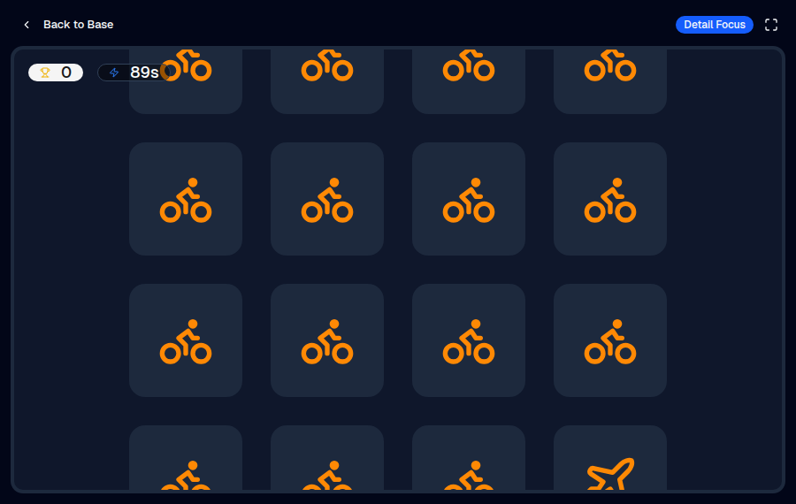

### 🚗 Traffic Jam
**Visual discrimination** — one vehicle in the grid is different from all the others.
Find it, and a fresh grid appears immediately.

</td>
<td width="50%" valign="top">

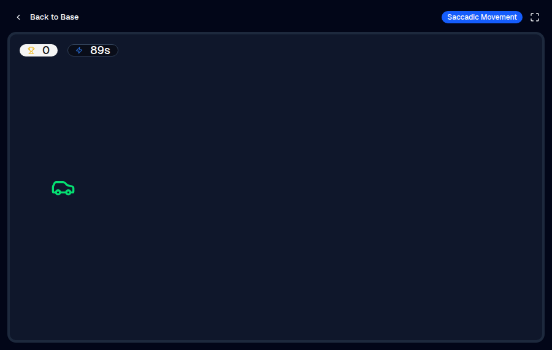

### 🏎️ Speedway Saccades
**Saccadic eye movements** — the car jumps from one side of the screen to the other,
forcing the fast, accurate eye jumps that reading depends on.

</td>
</tr>
<tr>
<td width="50%" valign="top">

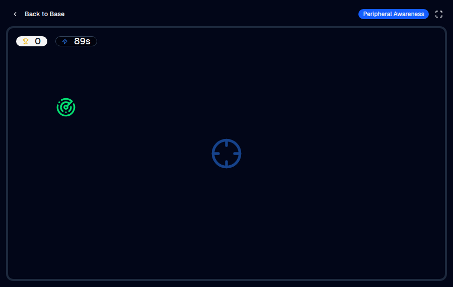

### 📡 Peripheral Patrol
**Peripheral awareness** — hold your gaze on the central crosshair while targets appear
around the edges of the screen. Widens the useful visual field.

</td>
<td width="50%" valign="top">

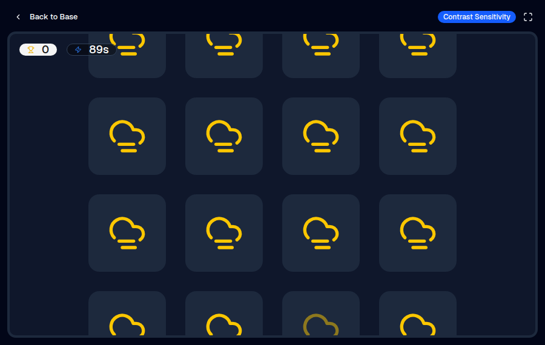

### 🌫️ Foggy Spotter
**Contrast sensitivity** — every tile looks the same except one, which is slightly faded.
Difficulty controls just how subtle that difference is.

</td>
</tr>
<tr>
<td width="50%" valign="top">

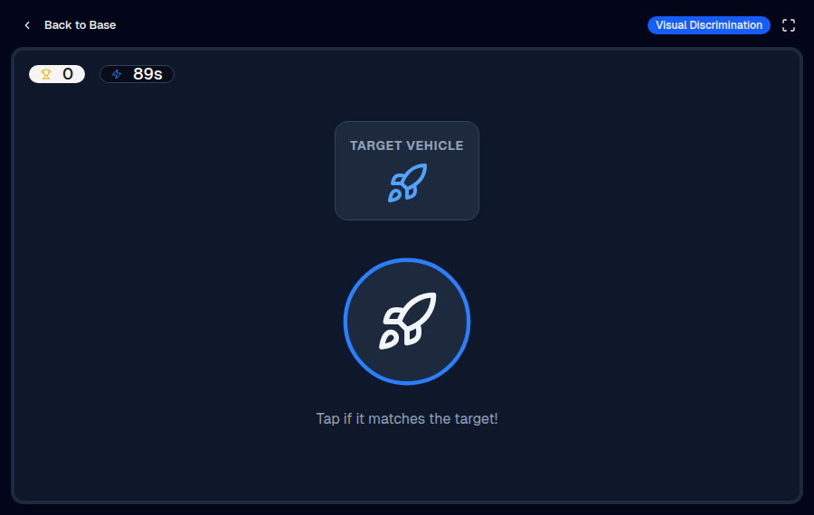

### 🛡️ Checkpoint
**Discrimination and reaction time** — a target vehicle is shown, then vehicles arrive one
at a time. Tap only the matching ones before the timer runs out.

</td>
<td width="50%" valign="top">

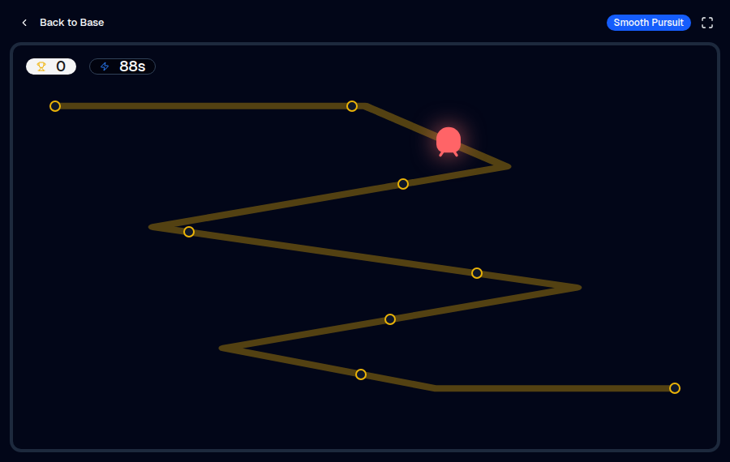

### 🚇 Metro Tracker
**Smooth pursuit** — a train runs slowly back and forth along a winding metro line, and
stations light up as it passes. The wide left-right sweeps exercise full horizontal
eye movement.

</td>
</tr>
<tr>
<td width="50%" valign="top">

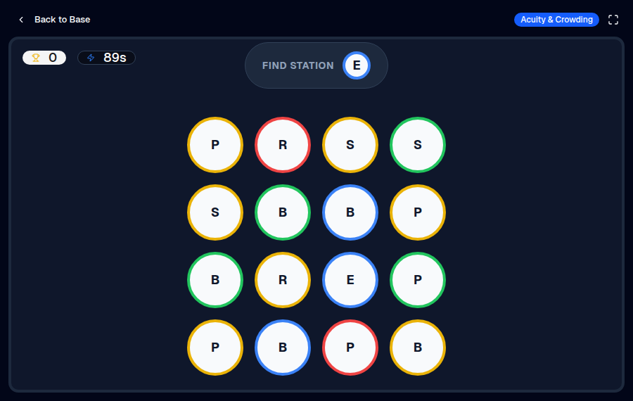

### 📍 Station Hunt
**Acuity under crowding** — find the announced station among look-alike letters packed
close together (E/F/H/L, O/Q/C/G). Crowded fine detail is the core deficit in amblyopia.

</td>
<td width="50%" valign="top">

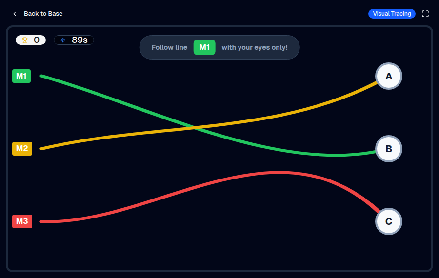

### 🗺️ Line Navigator
**Visual tracing** — follow one colored metro line through a tangle of crossing lines,
using your eyes only, and tap the terminal it reaches.

</td>
</tr>
<tr>
<td width="50%" valign="top">

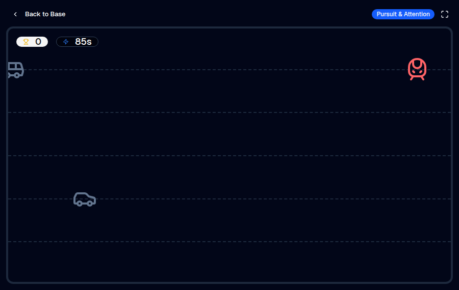

### 🚋 Railway Crossing
**Pursuit and selective attention** — trains and cars cross the screen on rail lanes.
Tap only the trains and let the cars pass: a go/no-go task that adds impulse control.

</td>
<td width="50%" valign="top">

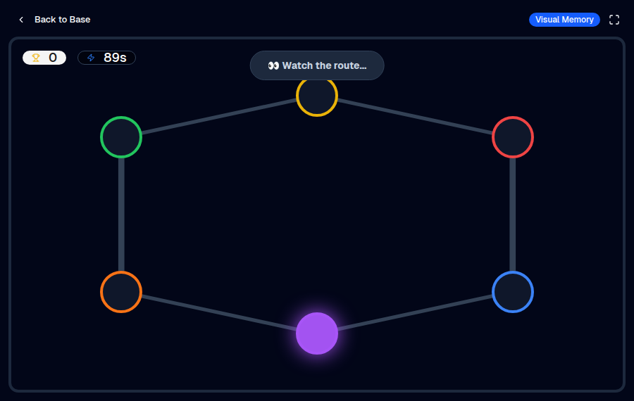

### 🧠 Metro Memory
**Visual memory** — stations light up in sequence on a mini metro map; repeat the route in
order. The route grows by one station after every success.

</td>
</tr>
</table>

## Parent's Corner

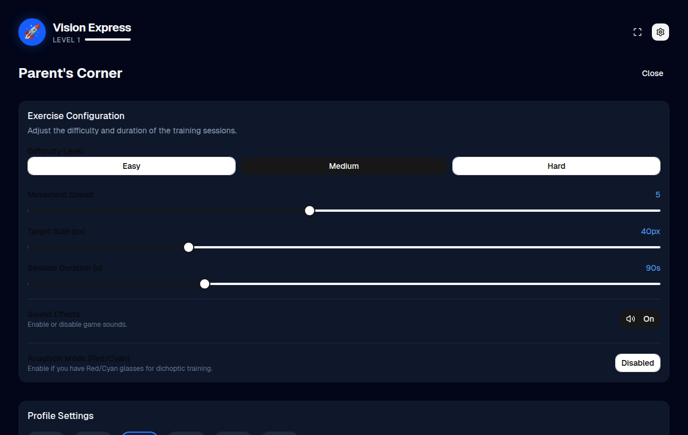

Every exercise reads from one shared configuration, so you can tune a session to the child
rather than to the game:

| Setting | What it does |
|---------|--------------|
| **Difficulty** | `easy` / `medium` / `hard` presets for speed, target size and grid density |
| **Movement speed** | How fast targets travel — lower it for younger children |
| **Target size** | 20–100px; larger targets suit deeper amblyopia |
| **Session duration** | 10–300 seconds per round |
| **Sound effects** | Feedback tones on and off |
| **Anaglyph mode** | Red/cyan dichoptic rendering (see below) |

Progress, level and per-exercise history are stored in the browser's `localStorage` under
`eyequest_user` — nothing is uploaded anywhere.

### Red/cyan anaglyph mode

With anaglyph mode on, targets render in pure red and all scenery in pure cyan. Wearing
red/cyan glasses, the eye behind the red filter sees the targets clearly while the other eye
sees only the background — so the weaker eye has to do the work while both eyes stay open.
This is the dichoptic principle used in clinical amblyopia software.

Cheap filters leak. To check a pair: put the glasses on, cover the red-lens eye, and look
through the cyan lens alone — the red targets should almost disappear. Ask your
ophthalmologist or orthoptist whether dichoptic training is appropriate, and which eye
should be behind the red filter.

## Getting started

**Prerequisites:** Node.js 18 or newer.

```bash
npm install     # install dependencies
npm run dev     # start the dev server on http://localhost:3000
```

Other scripts:

```bash
npm run build    # production build into dist/
npm run preview  # serve the production build locally
npm run lint     # type-check with tsc --noEmit
npm run clean    # remove dist/
```

## Deployment

Pushes to `main` build the app and publish it to GitHub Pages via
[.github/workflows/deploy-pages.yml](.github/workflows/deploy-pages.yml).

One-time setup: in **Settings → Pages**, set **Source** to **GitHub Actions**.

The site is served from `https://<user>.github.io/vision_hero_trainer/`, so `vite.config.ts`
sets `base` to `/vision_hero_trainer/` for production builds. Renaming the repository means
updating that value.

## Tech stack

| | |
|---|---|
| **UI** | React 19, TypeScript, Tailwind CSS v4 |
| **Build** | Vite 6 |
| **Animation** | Motion, canvas-confetti |
| **Icons** | lucide-react |
| **Audio** | Web Audio API (generated tones, no audio files) |
| **Storage** | Browser `localStorage` |

Components follow the [shadcn/ui](https://ui.shadcn.com) conventions and live in
[`components/ui`](components/ui). Game logic and screens are in
[`src/App.tsx`](src/App.tsx), with shared types and presets in
[`src/types.ts`](src/types.ts) and [`src/constants.ts`](src/constants.ts).

## Disclaimer

Vision Hero is a training aid, not a medical device, and it does not diagnose or treat any
condition. It is meant to complement — never replace — the treatment plan prescribed by a
qualified eye care professional, including patching schedules, glasses and follow-up
appointments. Always follow your ophthalmologist's or orthoptist's instructions on how long
and how often a child should train.

## License

Released under the [Apache License 2.0](LICENSE).
